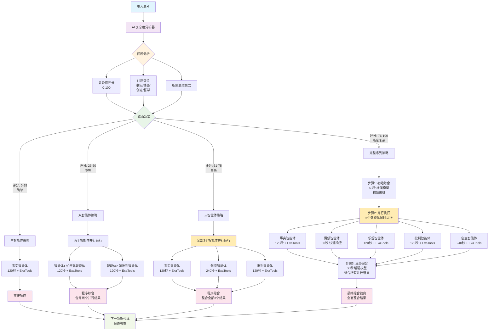

# 序列思考多智能体系统 (MAS) 

[](https://smithery.ai/server/@FradSer/mcp-server-mas-sequential-thinking) [](https://twitter.com/FradSer) [](https://www.python.org/downloads/) [](https://github.com/cognitivecomputations/agno)

[English](README.md) | 简体中文

该项目使用基于 **Agno** 框架构建并通过 **MCP** 提供服务的**多智能体系统 (MAS)** 实现高级序列思考过程。它通过利用协调的专业智能体进行更深入的分析和问题分解，代表了从简单状态跟踪方法的重大演进。

[](https://mseep.ai/app/fradser-mcp-server-mas-sequential-thinking)

## 这是什么?

这是一个 **MCP 服务器** - 不是独立应用程序。它作为后台服务运行,为你的 LLM 客户端(如 Claude Desktop)扩展复杂的序列思考能力。该服务器提供 `sequentialthinking` 工具,通过多个专门的 AI 智能体处理思考,每个智能体从不同的认知角度审视问题。

## 核心架构:多维度思维智能体

系统采用 **6 个专门的思维智能体**,每个都专注于不同的认知视角:

### 1. **事实智能体**
- **焦点**: 客观事实和验证数据
- **方法**: 分析性、基于证据的推理
- **能力**:
  - 网络研究获取当前事实 (通过 ExaTools)
  - 数据验证和来源引用
  - 信息缺口识别
- **时间分配**: 120 秒进行深入分析

### 2. **情感智能体**
- **焦点**: 直觉和情商
- **方法**: 直觉反应和感受
- **能力**:
  - 快速直觉响应 (30 秒快照)
  - 无需解释的本能反应
  - 情感模式识别
- **时间分配**: 30 秒(快速反应模式)

### 3. **批判智能体**
- **焦点**: 风险评估和问题识别
- **方法**: 逻辑审查和唱反调
- **能力**:
  - 研究反例和失败案例 (通过 ExaTools)
  - 识别逻辑缺陷和风险
  - 建设性地质疑假设
- **时间分配**: 120 秒进行深度分析

### 4. **乐观智能体**
- **焦点**: 利益、机会和价值
- **方法**: 积极探索且基于现实
- **能力**:
  - 研究成功案例 (通过 ExaTools)
  - 识别可行机会
  - 逻辑探索最佳场景
- **时间分配**: 120 秒进行平衡乐观分析

### 5. **创意智能体**
- **焦点**: 创新和替代解决方案
- **方法**: 横向思维和创意生成
- **能力**:
  - 跨行业创新研究 (通过 ExaTools)
  - 发散性思维技巧
  - 多方案生成
- **时间分配**: 240 秒(创造力需要时间)

### 6. **综合智能体**
- **焦点**: 整合和元认知编排
- **方法**: 整体综合和最终答案生成
- **能力**:
  - 将所有视角整合为连贯响应
  - 直接回答原始问题
  - 提供可操作的、用户友好的见解
- **时间分配**: 60 秒进行综合
- **注意**: 使用增强模型,不包含 ExaTools(专注于整合)

## AI 驱动的智能路由

系统使用 **AI 驱动的复杂度分析** 来确定最优思考序列:

### 处理策略:
1. **单智能体** (简单问题)
   - 直接的事实或情感响应
   - 针对直接查询的最快处理

2. **双智能体** (中等复杂度)
   - 两步序列(例如,乐观 → 批判)
   - 用于评估任务的平衡视角

3. **三智能体** (核心思考)
   - 事实 → 创意 → 综合
   - 哲学和分析问题

4. **完整序列** (复杂问题)
   - 全部 6 个智能体协调工作
   - 全面的多视角分析

AI 分析器评估:
- 问题复杂度和语义深度
- 主要问题类型(事实、情感、创意、哲学等)
- 最优解决方案所需的思维模式
- 适当的模型选择(增强型 vs 标准型)

### AI 路由流程图



**关键洞察:**
- **并行执行**: 非综合智能体同时运行以实现最高效率
- **综合整合**: 综合智能体串行处理并行结果
- **两种处理类型**:
  - **综合智能体**: 使用增强模型进行整合的真实AI智能体
  - **程序综合**: 当没有综合智能体时的代码合并
- **性能特点**: 并行处理同时优化速度和质量

## 研究能力 (ExaTools 集成)

**6 个智能体中的 4 个** 配备了通过 ExaTools 的网络研究能力:

- **事实智能体**: 搜索当前事实、统计数据、验证数据
- **批判智能体**: 查找反例、失败案例、监管问题
- **乐观智能体**: 研究成功故事、积极案例研究
- **创意智能体**: 发现不同行业的创新
- **情感和综合智能体**: 无 ExaTools(专注于内部处理)

研究功能是 **可选的** - 需要 `EXA_API_KEY` 环境变量。没有它系统也能完美工作,使用纯推理能力。

## 模型智能

### 双模型策略:
- **增强模型**: 用于综合智能体(复杂整合任务)
- **标准模型**: 用于各个思维智能体
- **AI 选择**: 系统根据任务复杂度自动选择正确的模型

### 支持的提供商:
- **DeepSeek** (默认) - 高性能、成本效益高
- **Groq** - 超快速推理
- **OpenRouter** - 访问多个模型
- **GitHub Models** - 通过 GitHub API 访问 OpenAI 模型
- **Anthropic** - 带提示缓存的 Claude 模型
- **Ollama** - 本地模型执行

## 与原版本 (TypeScript) 的主要区别

这个 Python/Agno 实现标志着从原始 TypeScript 版本的根本性转变：

| 特性/方面      | Python/Agno 版本 (当前)                                        | TypeScript 版本 (原始)                        |
| :------------------ | :------------------------------------------------------------------- | :--------------------------------------------------- |
| **架构**    | **多智能体系统 (MAS)**；智能体团队主动处理。 | **单类状态跟踪器**；简单日志/存储。 |
| **智能**    | **分布式智能体逻辑**；嵌入在专业智能体和协调器中。 | **仅外部 LLM**；无内部智能。     |
| **处理**      | **主动分析与综合**；智能体对思考进行*操作*。      | **被动日志**；仅记录思考。    |
| **框架**      | **Agno (MAS) + FastMCP (服务器)**；使用专用 MAS 库。     | **仅 MCP SDK**。                                    |
| **协调**    | **显式团队协调逻辑** (`Team` 在 `coordinate` 模式下)。  | **无**；无协调概念。                   |
| **验证**      | **Pydantic 模式验证**；健壮的数据验证。            | **基本类型检查**；可靠性较低。              |
| **外部工具**  | **集成 (通过研究员使用 Exa)**；可以执行研究任务。   | **无**。                                            |
| **日志**         | **结构化 Python 日志 (文件 + 控制台)**；可配置。      | **使用 Chalk 的控制台日志**；基本。             |
| **语言与生态系统** | **Python**；利用 Python AI/ML 生态系统。                    | **TypeScript/Node.js**。                              |

本质上，系统从被动的思考*记录器*演进为由协作 AI 智能体团队驱动的主动思考*处理器*。

## 工作原理 (多维度处理)

1.  **初始化：** 外部 LLM 使用 `sequentialthinking` 工具定义问题并启动过程。
2.  **工具调用：** LLM 使用当前思考调用 `sequentialthinking` 工具，根据 `ThoughtData` 模型结构化。
3.  **AI 复杂度分析：** 系统使用 AI 驱动的分析，基于问题复杂度和类型确定最优思考序列。
4.  **智能体路由：** 基于分析，系统将思考路由到适当的思维智能体（单一、双重、三重或完整序列）。
5.  **并行处理：** 多个思维智能体从其专业视角同时处理思考：
   - 事实智能体收集客观数据（可选网络研究）
   - 批判智能体识别风险和问题
   - 乐观智能体探索机会和利益
   - 创意智能体生成创新解决方案
   - 情感智能体提供直觉洞察
6.  **研究集成：** 配备 ExaTools 的智能体进行有针对性的网络研究以增强分析。
7.  **综合与整合：** 综合智能体使用增强模型将所有视角整合为连贯、可操作的响应。
8.  **响应生成：** 系统返回包含下一步指导的综合分析。
9.  **迭代：** 调用 LLM 使用综合响应制定下一个思考步骤或结束过程。

## 令牌消耗警告

**高令牌使用量：** 由于多智能体系统架构，此工具比单智能体替代方案或之前的 TypeScript 版本消耗显著**更多令牌**。每个 `sequentialthinking` 调用同时调用多个专门智能体，导致大幅增加的令牌使用量（可能比简单方法多 5-10 倍）。

这种并行处理相比简单的序列方法会导致大幅增加的令牌使用量（可能多 5-10 倍），但提供相应更深入和更全面的分析。

## MCP 工具: `sequentialthinking`

服务器公开一个处理序列思考的 MCP 工具:

### 参数:
```typescript
{
  thought: string,              // 当前思考步骤内容
  thoughtNumber: number,         // 序列号 (≥1)
  totalThoughts: number,         // 预估总步骤
  nextThoughtNeeded: boolean,    // 是否需要另一步?
  isRevision: boolean,           // 修订之前的思考?
  branchFromThought?: number,    // 分支点(用于探索)
  branchId?: string,             // 分支标识符
  needsMoreThoughts: boolean     // 需要扩展序列?
}
```

### 响应:
返回来自多智能体系统的综合分析,包括:
- 已处理的思考分析
- 下一步指导
- 分支和修订跟踪
- 状态和元数据

## 安装

### 前置要求

- Python 3.10+
- LLM API 访问(选择一个):
    - **DeepSeek**: `DEEPSEEK_API_KEY` (默认,推荐)
    - **Groq**: `GROQ_API_KEY`
    - **OpenRouter**: `OPENROUTER_API_KEY`
    - **GitHub Models**: `GITHUB_TOKEN`
    - **Anthropic**: `ANTHROPIC_API_KEY`
    - **Ollama**: 本地安装(无需 API 密钥)
- **可选**: `EXA_API_KEY` 用于网络研究能力
- `uv` 包管理器(推荐)或 `pip`

### 快速开始

#### 1. 通过 Smithery 安装(推荐)

```bash
npx -y @smithery/cli install @FradSer/mcp-server-mas-sequential-thinking --client claude
```

#### 2. 手动安装

```bash
# 克隆仓库
git clone https://github.com/FradSer/mcp-server-mas-sequential-thinking.git
cd mcp-server-mas-sequential-thinking

# 使用 uv 安装(推荐)
uv pip install .

# 或使用 pip
pip install .
```

### 配置

#### 对于 MCP 客户端 (Claude Desktop 等)

添加到你的 MCP 客户端配置:

```json
{
  "mcpServers": {
    "sequential-thinking": {
      "command": "mcp-server-mas-sequential-thinking",
      "env": {
        "LLM_PROVIDER": "deepseek",
        "DEEPSEEK_API_KEY": "你的_api_密钥",
        "EXA_API_KEY": "你的_exa_密钥_可选"
      }
    }
  }
}
```

#### 环境变量

创建 `.env` 文件或设置这些变量:

```bash
# LLM 提供商(必需)
LLM_PROVIDER="deepseek"  # deepseek, groq, openrouter, github, anthropic, ollama
DEEPSEEK_API_KEY="sk-..."

# 可选:增强/标准模型选择
# DEEPSEEK_ENHANCED_MODEL_ID="deepseek-chat"  # 用于综合
# DEEPSEEK_STANDARD_MODEL_ID="deepseek-chat"  # 用于其他智能体

# 可选:网络研究(启用 ExaTools)
# EXA_API_KEY="你的_exa_api_密钥"

# 可选:自定义端点
# LLM_BASE_URL="https://custom-endpoint.com"
```

### 模型配置示例

```bash
# Groq 使用不同模型
GROQ_ENHANCED_MODEL_ID="openai/gpt-oss-120b"
GROQ_STANDARD_MODEL_ID="openai/gpt-oss-20b"

# Anthropic 使用 Claude 模型
ANTHROPIC_ENHANCED_MODEL_ID="claude-3-5-sonnet-20241022"
ANTHROPIC_STANDARD_MODEL_ID="claude-3-5-haiku-20241022"

# GitHub Models
GITHUB_ENHANCED_MODEL_ID="gpt-4o"
GITHUB_STANDARD_MODEL_ID="gpt-4o-mini"
```

## 使用方法

### 作为 MCP 服务器

安装并在 MCP 客户端中配置后:

1. `sequentialthinking` 工具变为可用
2. 你的 LLM 可以用它处理复杂思考
3. 系统自动路由到适当的思维智能体
4. 结果被综合并返回给你的 LLM

### 直接执行

手动运行服务器进行测试:

```bash
# 使用已安装的脚本
mcp-server-mas-sequential-thinking

# 使用 uv
uv run mcp-server-mas-sequential-thinking

# 使用 Python
python src/mcp_server_mas_sequential_thinking/main.py
```

## 开发

### 设置

```bash
# 克隆仓库
git clone https://github.com/FradSer/mcp-server-mas-sequential-thinking.git
cd mcp-server-mas-sequential-thinking

# 创建虚拟环境
python -m venv .venv
source .venv/bin/activate  # Windows: .venv\Scripts\activate

# 使用开发依赖安装
uv pip install -e ".[dev]"
```

### 代码质量

```bash
# 格式化和检查
uv run ruff check . --fix
uv run ruff format .
uv run mypy .

# 运行测试(如果可用)
uv run pytest
```

### 使用 MCP Inspector 测试

```bash
npx @modelcontextprotocol/inspector uv run mcp-server-mas-sequential-thinking
```

打开 http://127.0.0.1:6274/ 并测试 `sequentialthinking` 工具。

## 系统特性

### 优势:
- **多视角分析**: 6 种不同的认知方法
- **AI 驱动路由**: 智能复杂度分析
- **研究能力**: 4 个智能体带网络搜索(可选)
- **灵活处理**: 从单一到完整序列策略
- **模型优化**: 增强/标准模型选择
- **提供商无关**: 支持多个 LLM 提供商

### 考虑因素:
- **令牌使用**: 多智能体处理比单智能体使用更多令牌
- **处理时间**: 复杂序列需要更长时间但提供更深入的见解
- **API 成本**: 研究能力需要单独的 Exa API 订阅
- **模型选择**: 增强模型成本更高但提供更好的综合

## 项目结构

```
mcp-server-mas-sequential-thinking/
├── src/mcp_server_mas_sequential_thinking/
│   ├── main.py                          # MCP 服务器入口点
│   ├── processors/
│   │   ├── multi_thinking_core.py       # 6 个思维智能体定义
│   │   └── multi_thinking_processor.py  # 序列处理逻辑
│   ├── routing/
│   │   ├── ai_complexity_analyzer.py    # AI 驱动分析
│   │   └── multi_thinking_router.py     # 智能路由
│   ├── services/
│   │   ├── server_core.py                   # ThoughtProcessor 实现
│   │   ├── workflow_executor.py
│   │   └── context_builder.py
│   └── config/
│       ├── modernized_config.py         # 提供商策略
│       └── constants.py                 # 系统常量
├── pyproject.toml                       # 项目配置
└── README.md                            # 此文件
```

## 更新日志

查看 [CHANGELOG.md](CHANGELOG.md) 了解版本历史。

## 贡献

欢迎贡献!请确保:

1. 代码遵循项目风格 (ruff, mypy)
2. 提交消息使用传统提交格式
3. 提交 PR 前所有测试通过
4. 文档根据需要更新

## 许可证

本项目采用 MIT 许可证 - 详见 LICENSE 文件。

## 致谢

- 使用 [Agno](https://github.com/agno-agi/agno) v2.0+ 框架构建
- 模型上下文协议由 [Anthropic](https://www.anthropic.com/) 提供
- 研究能力由 [Exa](https://exa.ai/) 支持(可选)
- 多维度思维灵感来自 Edward de Bono 的工作

## 支持

- GitHub Issues: [报告错误或请求功能](https://github.com/FradSer/mcp-server-mas-sequential-thinking/issues)
- 文档: 查看 CLAUDE.md 了解详细实现说明
- MCP 协议: [官方 MCP 文档](https://modelcontextprotocol.io/)

---

**注意**: 这是一个 MCP 服务器,设计用于与 MCP 兼容的客户端(如 Claude Desktop)配合使用。它不是独立的聊天应用程序。